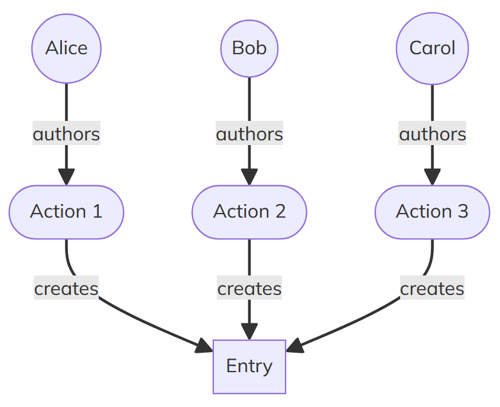
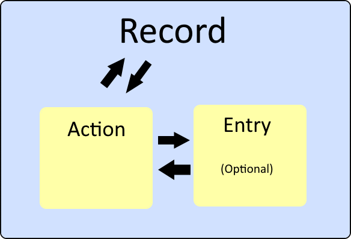

Actions and Entries
---
layout: intro
---

# Data in Holochain

<!-- 
Instructor Notes:
- This is the first slide on Holochain's data model - emphasize its importance
- The data model is one of the most unique aspects of Holochain
- Consider drawing parallels to more familiar systems (like Git) to help understanding
- Take time to explain these three points thoroughly before moving forward
-->

<v-clicks>

- Entries are the nouns
- Actions are the verbs
- Records are a wrapper of an Entry + Action

</v-clicks>

---
layout: fact
---

It's generally most useful to think about a Record <br/>as the primary unit of data.

<!-- 
Instructor Notes:
- Records are what developers will be working with most often
- They are comprehensive as they contain both the data and metadata
- This approach differs from traditional databases where you typically just work with entries/rows
-->

<v-click>
There are lots of ways to reference data, a good default is the <br/>hash of the create Action.
</v-click>

<!-- 
Instructor Notes:
- Explain that entry hashes might change but action hashes remain stable
- When a student needs to reference data, action hashes provide more stable references
- This becomes important in Challenge 1, where they need to track jokes across updates
-->

---


# Actions in Holochain

> A record of a state change in an agent's source chain
> 
> [Glossary: Action](https://developer.holochain.org/resources/glossary/#action)

<!-- 
Instructor Notes:
- Compare actions to Git commits (if students are familiar with Git)
- Actions form the backbone of the source chain - an immutable history of all activity
- You might show a visual of a source chain with several actions connected
- Emphasize that EVERY state change is an action - there are no side effects
-->

<v-clicks>

- Actions are the backbone of Holochain's data model
- They store metadata for each record
- Every action is committed to the agent's source chain
- Actions provide a tamper-evident history of all changes
- Actions are immutable once committed to the source chain
- Essential for maintaining data integrity and traceability

</v-clicks>
---

# Action Contents

<!-- 
Instructor Notes:
- Go through these items slowly, explaining each one's purpose
- The agent ID is crucial as it establishes authorship and accountability
- The hash of the previous action creates the chain-like structure
- The sequence number allows for integrity checks and ordering verification
- Emphasize that the deterministic hash of an action is how it's referenced
-->

<v-clicks>

- The agent ID of the author
- A timestamp of when the action was committed
- The type of action (e.g., Create, Update, Delete)
- The hash of the previous action in the author's source chain
- The index of the action in the author's source chain (action sequence)
- If there's a corresponding entry, the hash of that entry

</v-clicks>

---

# Action Properties

<!-- 
Instructor Notes:
- Emphasize how these properties help maintain integrity of the source chain
- This is what makes Holochain tamper-evident
-->

<v-clicks>

- This structure ensures:
  - Chronological ordering of actions
  - Verification of action authorship
  - Linking between related pieces of data

</v-clicks>

---

# Understanding Hash Types

<!-- 
Instructor Notes:
- This is a new section that helps clarify the different hash types
- Students often get confused about when to use which hash type
- These examples directly reflect what they'll implement in Challenge 1
- Emphasize that for Challenge 1, they'll need to understand all three types
- AnyDhtHash is particularly useful for more flexible code
-->

<v-clicks>

- **ActionHash**: Hash of an Action (used to reference the specific action)
  ```rust
  pub fn get_joke_by_hash(original_joke_hash: ActionHash) -> ExternResult<Option<Record>> {
      // Implementation...
  }
  ```

- **EntryHash**: Hash of an Entry (based on content)
  ```rust
  // Get the entry hash from a record
  let entry_hash = record.signed_action.hashed.content.entry_hash;
  ```

- **AnyDhtHash**: Generic type that can be either ActionHash or EntryHash
  ```rust
  pub fn get_joke_by_hash(original_joke_hash: AnyDhtHash) -> ExternResult<Option<Details>> {
      // Can handle both action and entry hashes
  }
  ```

</v-clicks>

[hdk docs: ActionHash](https://docs.rs/holo_hash/latest/holo_hash/hash_type/struct.ActionHash.html)
[hdk docs: EntryHash](https://docs.rs/holo_hash/latest/holo_hash/hash_type/struct.EntryHash.html)
[hdk docs: AnyDhtHash](https://docs.rs/holo_hash/latest/holo_hash/hash_type/struct.AnyDhtHash.html)

---

## Common Action Types

<!-- 
Instructor Notes:
- These are the primary action types that students will use in Challenge 1
- Note that Create/Update/Delete matches the CRUD operations they're familiar with
- Emphasize the "original data remains" point - this is a key difference from traditional databases
- The status change for delete operations is an important concept they'll test in Challenge 1
-->

<v-clicks>

1. Create
   - Introduces new data to the DHT
   - Always corresponds to a new Entry
   - Creates a new ActionHash

2. Update
   - Modifies existing data
   - References the original Entry being updated
   - Creates a new ActionHash and EntryHash
   - Original data remains in DHT

3. Delete
   - Marks data as deleted (changes status to "Dead")
   - Creates a new ActionHash (but no new Entry)

</v-clicks>

---

# Entries in Holochain

> A basic unit of application data in a Holochain app
> 
> [Glossary: Entry](https://developer.holochain.org/resources/glossary/#entry)

<!-- 
Instructor Notes:
- Entries are the actual data being stored (the "what")
- Compare to traditional DB records/rows but with immutability
- In Challenge 1, the "Joke" entry contains the joke text and creator
- Emphasize that entries once created are permanent (even if deleted, they're just marked as deleted)
- The content-addressed nature is key to understanding Holochain's data model
-->

<v-clicks>

- Entries are units of application data
- Examples: Text messages, blog posts, user profiles
- Stored as arbitrary blobs of bytes
- The entry's address is the hash of its content
- Once on the DHT, entries cannot be completely removed
- Same content = same hash (content-addressed)

</v-clicks>

---

# Entry Types

> A specification for any sort of entry that a DNA should recognize and understand, similar to an OOP class or database table schema
> 
> [Glossary: Entry Type](https://developer.holochain.org/resources/glossary/#entry-type)

<!--
Instructor Notes:
- Entry types are similar to database table definitions
- They define the "shape" of data and how it should be validated
- In Challenge 1, students will work with a pre-defined "Joke" entry type
- Mention that these definitions live in the integrity zome (separation of concerns)
- Validation rules can be complex and cross-reference other entries
-->

<v-clicks>

- Defining your Entry Types is a key part of building a holochain application
- Defines whether Entries of this type should be private (only on author source chain) or public (on the DHT)
- Entries are content-addressed blobs of bytes (hash of content is their ID)
- Entry Types provide schema for deserialization and validation
- Each Entry Type defines privacy rules (DHT vs private source chain)
- Validation rules can cross-reference other entry types

</v-clicks>

---

# Records

> The data structure that holds an action in an agent's source chain.
> 
> [Glossary: Record](https://developer.holochain.org/resources/glossary/#record)

<!--
Instructor Notes:
- This is a crucial concept that ties together actions and entries
- Records are the primary unit of data that developers work with
- Students will return Records from their CRUD functions in Challenge 1
- The image visually reinforces the relationship between entries and actions
- Two records might contain identical entries but will always have different actions
-->

<div class="flex">
<div class="w-2/3">

<v-clicks>

- Record = Entry + Action
- If Entry contents is the same then the hash will be the same
- A Record is always unique (even with identical entries)
- Records are how you'll work with data most of the time

</v-clicks>

</div>
<div class="w-1/3">

<v-click>

</img>

</v-click>

</div>
</div>

---
layout: fact
---

If a record was a HTTP response, the action would be the header and the entry would be the body.

<!--
Instructor Notes:
- This analogy helps students understand the relationship between actions and entries
- Actions contain metadata (like headers) while entries contain the actual data (like bodies)
- The separation of concerns is similar to how HTTP separates metadata from content
- This analogy can be particularly helpful for web developers
-->

---

# Entry Type Definition

Entry types are defined in the integrity zome:

<!--
Instructor Notes:
- This shows actual code from the Challenge 1 project
- Walk through how the structure is defined with attributes
- Note that creator is an AgentPubKey, which is a special Holochain type
- The entry_defs! macro is how entries are registered with Holochain
-->

```rust
// In dnas/jokes/zomes/integrity/jokes/src/lib.rs
#[hdk_entry_helper]
#[derive(Clone)]
pub struct Joke {
    pub text: String,
    pub creator: AgentPubKey,
}

entry_defs![
    PathEntry::entry_def(),
    Joke::entry_def()
];
```

[hdk docs: hdk_entry_helper](https://docs.rs/hdk/latest/hdk/attr.hdk_entry_helper.html)
[hdk docs: entry_defs!](https://docs.rs/hdk/latest/hdk/macro.entry_defs.html)

---
layout: fact
---

When defining an Entry Type, remember that every action stores the id of the author so you may not need an agent_id field.

<!--
Instructor Notes:
- A common question students have is "why include creator in the Joke entry when actions already have author?"
- This provides insight into that design decision
- Some entries need an agent field for functionality, not just for authorship tracking
- In Challenge 1, this helps make jokes unique (same text by different creators = different entries)
- This is a subtle but important design consideration
-->

<v-click>
One reason to include an agent_id in an EntryType is to make Entries unique to an agent.
</v-click>


---

# Rust Error Handling 

<!--
Instructor Notes:
- Error handling is important for building robust applications
- The Rust code uses ExternResult, ? operator, and wasm_error!
- This pattern will be used throughout Challenge 1
- Good error messages are crucial for debugging
-->

<v-clicks>

- In Rust code, use `ExternResult<T>` for zome functions
- Use the `?` operator to propagate errors
- Create descriptive error messages with `wasm_error!`

```rust
// Good error handling example
#[hdk_extern]
pub fn create_joke(joke: Joke) -> ExternResult<Record> {
    let joke_hash = create_entry(&EntryTypes::Joke(joke.clone()))?;
    
    let record = get(joke_hash.clone(), GetOptions::default())?.ok_or(
        wasm_error!(WasmErrorInner::Guest(
            String::from("Could not find the newly created Joke")
        ))
    )?;
    
    Ok(record)
}
```

</v-clicks>


---

# Create Operation

Implemented in the coordination zome:

<!--
Instructor Notes:
- This is the create_joke function students will implement in Challenge 1
- Walk through each line explaining what it does:
  1. Creating an entry with create_entry
  2. Getting the record back with get
  3. Error handling with ok_or and wasm_error
  4. Returning the record with Ok(record)
- Mention the error handling pattern with ExternResult and ? operator
- This follows a common pattern they'll use for all CRUD operations
-->

```rust
#[hdk_extern]
pub fn create_joke(joke: Joke) -> ExternResult<Record> {
    // Create the entry and get its hash
    let joke_hash = create_entry(&EntryTypes::Joke(joke.clone()))?;
    
    // Retrieve the record using the hash
    let record = get(joke_hash.clone(), GetOptions::default())?.ok_or(
        wasm_error!(WasmErrorInner::Guest(String::from("Could not find the newly created Joke")))
    )?;
    
    // Return the full record
    Ok(record)
}
```

- [hdk docs: create_entry](https://docs.rs/hdk/latest/hdk/entry/fn.create_entry.html)

---

# Read: Basic Get Function

<!--
Instructor Notes:
- get() is simpler but get_details() provides more information
- For Challenge 1, they'll need to implement both
- Walk through how get() works and what it returns
- Link to the documentation for further reading
-->

```rust
// Basic get - returns a single Record
#[hdk_extern]
pub fn get_joke(joke_hash: ActionHash) -> ExternResult<Option<Record>> {
    get(joke_hash, GetOptions::default())
}
```

[hdk docs: get](https://docs.rs/hdk/latest/hdk/entry/fn.get.html)

---

# Read: Get Details Function

<!--
Instructor Notes:
- get_details() provides more information, including entry status
- The match pattern is common in Holochain and worth explaining in detail
- For Challenge 1, they'll need get_details to check entry status
-->

```rust
// Get details - returns more information including entry status
#[hdk_extern]
pub fn get_joke_by_hash(original_joke_hash: ActionHash) -> ExternResult<Option<Record>> {
    let Some(details) = get_details(original_joke_hash, GetOptions::default())? else {
        return Ok(None);
    };
    match details {
        Details::Record(details) => Ok(Some(details.record)),
        _ => {
            Err(wasm_error!(WasmErrorInner::Guest(String::from("Malformed get details response"))))
        }
    }
}
```

[hdk docs: get_details](https://docs.rs/hdk/latest/hdk/entry/fn.get_details.html)

---

# Get Details: Flexible Version

<!--
Instructor Notes:
- This is a more advanced version of get_joke_by_hash that students will implement in the final part of Challenge 1
- It can handle both ActionHash and EntryHash through AnyDhtHash
- The Details::Record vs Details::Entry distinction is important
- Each type contains different information about the entry/record
-->

```rust
// More flexible version from Challenge 1 using AnyDhtHash
#[hdk_extern]
pub fn get_joke_by_hash(hash: AnyDhtHash) -> ExternResult<Option<Details>> {
    let Some(details) = get_details(hash, GetOptions::default())? else {
        return Ok(None);
    };

    match details {
        Details::Record(details) => {
            // Contains record + entry_dht_status + action_dht_status + updates + deletes
            Ok(Some(Details::Record(details)))
        },
        Details::Entry(details) => {
            // Contains entry + entry_dht_status + actions
            Ok(Some(Details::Entry(details)))
        },
        _ => {
            Err(wasm_error!(WasmErrorInner::Guest(String::from("Malformed response"))))
        }
    }
}
```

[hdk docs: get_details](https://docs.rs/hdk/latest/hdk/entry/fn.get_details.html)

---

# Update Operation

<!--
Instructor Notes:
- This is the update_joke function students will implement in Challenge 1
- Note the struct for input - this is because we need multiple parameters
- Walk through each line explaining what it does
- previous_joke_hash is crucial - it's what connects the update to the original entry
- This pattern follows CRUD but with Holochain-specific considerations
- The pattern is similar to create, but uses update_entry instead of create_entry
-->

```rust
#[derive(Serialize, Deserialize, Debug)]
pub struct UpdateJokeInput {
    pub previous_joke_hash: ActionHash,  // Hash of the action we're updating
    pub updated_joke: Joke,              // New joke content
}

#[hdk_extern]
pub fn update_joke(input: UpdateJokeInput) -> ExternResult<Record> {
    let updated_joke_hash = update_entry(
        input.previous_joke_hash.clone(), 
        &input.updated_joke
    )?;
    
    let record = get(updated_joke_hash.clone(), GetOptions::default())?.ok_or(
        wasm_error!(WasmErrorInner::Guest(String::from("Could not find the newly updated Joke")))
    )?;
    
    Ok(record)
}
```

[hdk docs: update_entry](https://docs.rs/hdk/latest/hdk/entry/fn.update_entry.html)

---

# Important Concept: Entry Updating

<!--
Instructor Notes:
- This is a crucial concept for students to understand
- Holochain never modifies existing data - it only adds new data
- This differs significantly from traditional databases
- The immutable history is similar to blockchain but more efficient
- In Challenge 1, students will observe this behavior when updating jokes
- They should test this by looking at the DHT state in the playground
-->

<v-clicks>

- Updates in Holochain don't modify the original entries
- Instead, they create new entries and link them to previous ones
- The original entries remain in the DHT forever
- This creates an immutable history of all changes
- When retrieving data, you need to decide:
  - Do you want the latest version?
  - Do you want the entire history?
  - Do you need to check if an entry has been deleted?

</v-clicks>

---

# Delete Operation

<!--
Instructor Notes:
- This is the delete_joke function students will implement in Challenge 1
- It's simpler than create/update but has some important nuances
- delete_entry doesn't remove data - it marks it as "Dead"
-->

<v-clicks>

```rust
#[hdk_extern]
pub fn delete_joke(original_joke_hash: ActionHash) -> ExternResult<ActionHash> {
    // Returns the hash of the delete action
    delete_entry(original_joke_hash)
}
```

</v-clicks>

<v-clicks>

- Delete creates a Delete action that marks entries as "Dead"
- Original data remains accessible through history
- You can check if an entry is deleted with:

</v-clicks>

<v-clicks>

```rust
// Check deletion status
let details = get_details(entry_hash, GetOptions::default())?;
if let Details::Entry(details) = details {
    if details.entry_dht_status == EntryDhtStatus::Dead {
        // Entry has been deleted
    }
}
```

</v-clicks>

<v-clicks>

[hdk docs: delete_entry](https://docs.rs/hdk/latest/hdk/entry/fn.delete_entry.html)

</v-clicks>

---

# Entry Status & Lifecycle

<!-- 
Instructor Notes:
- This section introduces the concept of entry status
- Show how to work with entry status in Challenge 1
-->

<v-clicks>

- Entries on the DHT have a status that indicates their lifecycle
- Status values:
  - `Live`: Entry is active and usable 
  - `Dead`: Entry has been deleted
  - `Pending`: Entry is in process of validation
- You can check entry status using `get_details()`

</v-clicks>

---

# UI-Backend Connection: Setup

<div class="flex">
<div class="w-1/2">

<v-clicks>

- UI connects to Holochain via WebSocket
- `@holochain/client` creates connection
- `AppAgentWebsocket` client handles calls
- Secure and efficient connection

</v-clicks>

</div>
<div class="w-1/2">

<v-clicks>

```typescript
import type { AppClient } from "@holochain/client";
import { AppWebsocket } from "@holochain/client";

let client: AppClient | undefined;

const appClientContext = {
  getClient: async () => {
    if (!client) {
      client = await AppWebsocket.connect();
    }
    return client;
  },
};

onMount(async () => {
  try {
    client = await appClientContext.getClient();
  } catch (e) {
    console.log(e)
  } 
});

```

</v-clicks>

</div>
</div>

---

# UI-Backend: API Calls

<div class="flex">
<div class="w-1/2">

<v-clicks>

- `callZome()` invokes zome functions
- Async/await for handling responses
- Structured payloads for parameters
- Returns ActionHash for created entries
- MessagePack-based serialization

</v-clicks>

</div>
<div class="w-1/2">

<v-clicks>

```typescript
// Create a joke
const record = await client.callZome({
  cap_secret: null,
  role_name: "jokes",
  zome_name: "jokes",
  fn_name: "create_joke",
  payload: {
    text: "Why did the crab...",
    creator: myAgentKey
  }
});

// Get the ActionHash
const actionHash = record.signed_action.hashed.hash;
const hash = encodeHashToBase64(actionHash);
console.log("New joke hash:", hash);
```

</v-clicks>

</div>
</div>

---

# Visualizing the DHT in Playground

<!--
Instructor Notes:
- The Holochain Playground is a crucial tool for learning
- In Challenge 1, students will use it to observe source chains and the DHT
- Encourage students to explore the playground during the challenge
- Seeing the source chain grow helps understand the immutable chain concept
- Live demo of the playground
-->

<v-clicks>

- Holochain Playground shows the DHT structure visually
- Explore how source chains record actions
- See how entries are distributed across the network
- Observe entry status (Live/Dead) after updates and deletes
- View the hash values for both actions and entries
- Understand the relationship between actions and entries

</v-clicks>

---

# Summary

<!--
Instructor Notes:
- Recap the key points covered in this presentation
- Emphasize the immutable and action-based nature of Holochain
- The image helps visualize the Record structure
- These concepts are foundational for all Holochain development
- Understanding them is crucial for completing Challenge 1
- These concepts will be built upon in future challenges
-->

<div class="flex">

<div class="w-1/2">

<v-clicks>

- Records are the fundamental unit of data in Holochain
- Records consist of an Action and (optionally) an Entry
- Actions contain metadata about state changes
- Entries contain the actual application data
- Updates and deletes don't remove data, they add new actions
- Entry status (Live/Dead) tracks the lifecycle of data
- Understanding this model is crucial for effective Holochain development

</v-clicks>

</div>

<div class="w-[40%] ml-auto">

<v-click>

</img>

</v-click>

</div>

</div>


---
layout: end
---

# Challenge 1
[Actions & Entries](https://github.com/CodeWithJV/holochain-challenge-1)

<!--
Instructor Notes:
- Introduce Challenge 1 as a hands-on application of the concepts covered
- It involves creating a joke application with CRUD operations
- Students will implement these operations and observe the behavior
- The challenge helps solidify understanding of actions and entries
- Encourage students to use the playground to visualize their changes
- Remind them to read the README thoroughly before starting
- Suggest pairing for more effective learning
-->
