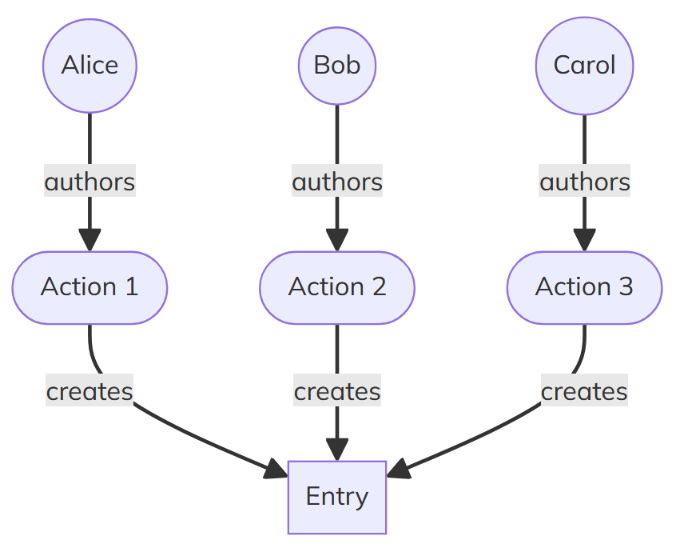
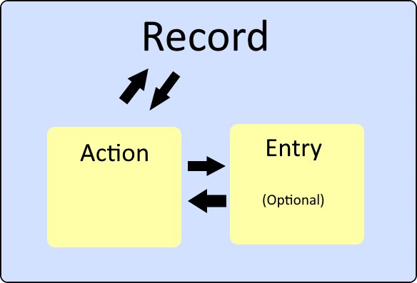

Actions and Entries
---
layout: intro
---

# Data in Holochain

<v-clicks>

- Entries are the nouns
- Actions are the verbs
- Records are a wrapper of an Entry + Action

</v-clicks>

---
layout: fact
---

It’s generally most useful to think about a Record <br/>as the primary unit of data.


<v-click>
There are lots of ways to reference data, a good default is the <br/>hash of the create Action.
</v-click>

---


# Actions in Holochain

> A record of a state change in an agent's source chain
> 
> [Glossary: Action](https://developer.holochain.org/resources/glossary/#action)

<v-clicks>

- Actions are the backbone of Holochain's data model
- They store metadata for each record
- Every action is committed to the agent's source chain
- Actions provide a tamper-evident history of all changes
- Essential for maintaining data integrity and traceability

</v-clicks>
---

# Action Contents

<v-clicks>

- The agent ID of the author
- A timestamp of when the action was committed
- The type of action (e.g., Create, Update, Delete)
- The hash of the previous action in the author's source chain
- The index of the action in the author's source chain (action sequence)
- If there's a corresponding entry, the hash of that entry

</v-clicks>

<v-clicks>

- This structure ensures:
  - Chronological ordering of actions
  - Verification of action authorship
  - Linking between related pieces of data

</v-clicks>

---

## Common Action Types

<v-clicks>

1. Create
   - Introduces new data to the DHT
   - Always corresponds to a new Entry

2. Update
   - Modifies existing data
   - References the original Entry being updated

3. Delete
   - Marks data as deleted (but doesn't remove it entirely)
   - Allows for data recovery and maintains history

</v-clicks>

---

# Entries in Holochain

> A basic unit of application data in a Holochain app
> 
> [Glossary: Entry](https://developer.holochain.org/resources/glossary/#entry)

<v-clicks>

- Entries are units of application data
- Examples: Text messages, blog posts, user profiles
- Stored as arbitrary blobs of bytes
- The entry's address is the hash of its content
- Once on the DHT, entries cannot be completely removed

</v-clicks>

---

# Entry Types

> A specification for any sort of entry that a DNA should recognize and understand, similar to an OOP class or database table schema
> 
> [Glossary: Entry Type](https://developer.holochain.org/resources/glossary/#entry-type)
<v-clicks>

- Defining your Entry Types is a key part of building a holochain application
- Defines whether Entries of this type should be private (only on author source chain) or public (on the DHT)
- Entries are just blobs of bytes, Entry Types are used to deserialize
- Each Entry Type can have its own validation rules

</v-clicks>

---

# Records

> The data structure that holds an action in an agent’s source chain.
> 
> [Glossary: Record](https://developer.holochain.org/resources/glossary/#record)

<v-clicks>

- Record = Entry + Action
- If Entry contents is the same then the hash will be the same
- A Record is always unique

</v-clicks>
<v-clicks>

</img>

</v-clicks>

---
layout: fact
---

If a record was a HTTP response, the action would be the header and the entry would be the body.

---

# Entry Types 

are defined in the integrity zome


```rust
#[hdk_entry_helper]
#[derive(Clone)]
pub struct Joke {
    pub text: String,
    pub creator: AgentPubKey,
}
```

This defines the structure of a Joke entry.

---
layout: fact
---

When defining an Entry Type, remember that every action stores the id of the author so you may not need an agent_id field.

<v-click>
One reason to include an agent_id in an EntryType is to make Entries unique to an agent.
</v-click>


---

# CRUD Operations 

are defined in the coordination zome

```rust
#[hdk_extern]
pub fn create_joke(joke: Joke) -> ExternResult<Record> {
    let joke_hash = create_entry(&EntryTypes::Joke(joke.clone()))?;
    let record = get(joke_hash.clone(), GetOptions::default())?.ok_or(
        wasm_error!(WasmErrorInner::Guest(String::from("Could not find the newly created Joke")))
    )?;
    Ok(record)
}
```

- [hdk docs: create_entry](https://docs.rs/hdk/latest/hdk/entry/fn.create_entry.html)
- [hdk docs: get](https://docs.rs/hdk/latest/hdk/entry/fn.get.html)

This function creates a new joke entry and returns the corresponding record.

---

# Get Details

`get` returns one record, `get_details` returns many

```rust
#[hdk_extern]
pub fn get_joke_by_hash(original_joke_hash: ActionHash) -> ExternResult<Option<Record>> {
    let Some(details) = get_details(original_joke_hash, GetOptions::default())? else {
        return Ok(None);
    };
    match details {
        Details::Record(details) => Ok(Some(details.record)),
        _ => {
            Err(wasm_error!(WasmErrorInner::Guest(String::from("Malformed get details response"))))
        }
    }
}

```

[hdk docs: get_details](https://docs.rs/hdk/latest/hdk/entry/fn.get_details.html)
---

# Update Entry

```rust
#[derive(Serialize, Deserialize, Debug)]
pub struct UpdateJokeInput {
    pub previous_joke_hash: ActionHash,
    pub updated_joke: Joke,
}

#[hdk_extern]
pub fn update_joke(input: UpdateJokeInput) -> ExternResult<Record> {
    let updated_joke_hash = update_entry(input.previous_joke_hash.clone(), &input.updated_joke)?;
    let record = get(updated_joke_hash.clone(), GetOptions::default())?.ok_or(
        wasm_error!(WasmErrorInner::Guest(String::from("Could not find the newly updated Joke")))
    )?;
    Ok(record)
}
```

[hdk docs: update_entry](https://docs.rs/hdk/latest/hdk/entry/fn.update_entry.html)

---

# Delete Entry

```rust

#[hdk_extern]
pub fn delete_joke(original_joke_hash: ActionHash) -> ExternResult<ActionHash> {
    delete_entry(original_joke_hash)
}
```

[hdk docs: delete_entry](https://docs.rs/hdk/latest/hdk/entry/fn.delete_entry.html)

---

# Summary

<div class="flex">

<div class="w-1/2">

<v-clicks>

- Records are the fundamental unit of data in Holochain
- Records consist of an Action and (optionally) an Entry
- Actions contain metadata about state changes
- Entries contain the actual application data
- This structure ensures data integrity and traceability
- Understanding this model is crucial for effective Holochain development

</v-clicks>

</div>

<div class="w-[40%] ml-auto">

<v-click>

</img>

</v-click>

</div>

</div>


---
layout: end
---

# Challenge 1
[Actions & Entries](https://github.com/CodeWithJV/holochain-challenge-1)


