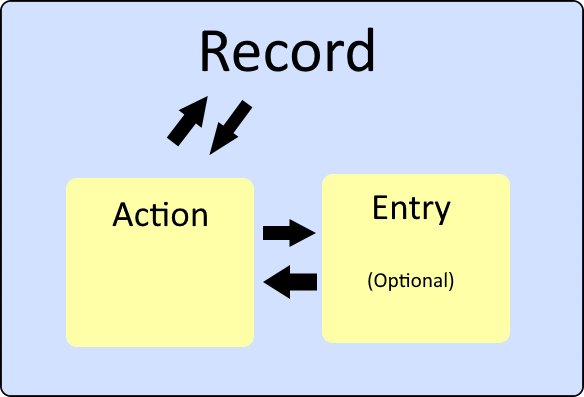

Actions and Entries
---
layout: intro
---

# Data in Holochain

<v-clicks>

- Holochain uses a unique data model
- Each piece of data is represented as a Record
- Every Record contains an Action

</v-clicks>

---

# Actions in Holochain

<v-clicks>

- Actions are the backbone of Holochain's data model
- They store metadata for each record
- Every action is committed to the agent's source chain
- Actions provide a tamper-evident history of all changes
- Essential for maintaining data integrity and traceability

</v-clicks>

---

# Action Contents

<v-clicks>

An Action contains:

- The agent ID of the author
- A timestamp of when the action was committed
- The type of action (e.g., Create, Update, Delete)
- The hash of the previous action in the author's source chain
- The index of the action in the author's source chain (action sequence)
- If there's a corresponding entry, the hash of that entry

</v-clicks>

<v-clicks>

- This structure ensures:
  - Chronological ordering of actions
  - Verification of action authorship
  - Linking between related pieces of data

</v-clicks>

---

## Common Action Types

<v-clicks>

1. Create
   - Introduces new data to the DHT
   - Always corresponds to a new Entry

2. Update
   - Modifies existing data
   - References the original Entry being updated

3. Delete
   - Marks data as deleted (but doesn't remove it entirely)
   - Allows for data recovery and maintains history

</v-clicks>

<v-clicks>

- Note: Create and Update actions typically correspond to an Entry
- The action type determines how the DHT processes and stores the data

</v-clicks>

---

# Entries in Holochain

<v-clicks>

- Entries are units of application data
- Examples: Text messages, blog posts, user profiles
- Stored as arbitrary blobs of bytes
- The entry's address is the hash of its content
- Once on the DHT, entries cannot be completely removed
- Each entry contains the hash of its associated action

</v-clicks>

---

# Summary

<v-clicks>

- Records are the fundamental unit of data in Holochain
- Records consist of an Action and (optionally) an Entry
- Actions contain metadata about state changes
- Entries contain the actual application data
- This structure ensures data integrity and traceability
- Understanding this model is crucial for effective Holochain development

</v-clicks>

<v-click>

</img>

</v-click>

---
layout: end
---

# Challenge 1
Actions & Entries

